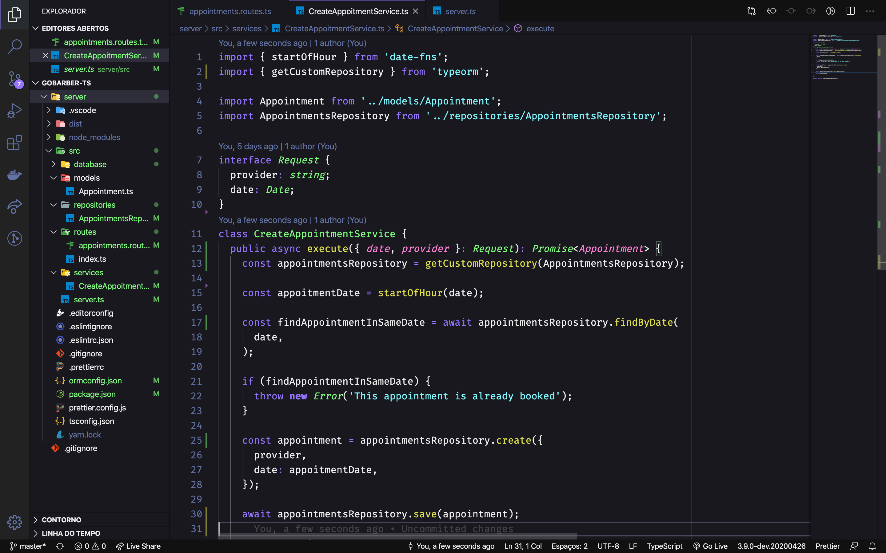

# Rocketseat Theme unofficial for [Visual Studio Code](http://code.visualstudio.com)

> A dark theme for [Visual Studio Code](http://code.visualstudio.com).



## OBS: Este tema irá substituir seu tema Dracula. O processo é reversível.

## Instalação

```
# Clone o repositório e entre na pasta.
$ git clone https://github.com/flaviohugo14/vscode-theme-rocketseat
$ cd vscode-theme-rockeseat

# Instale as dependências
$ npm install

# Crie o build
$ npm run build

# Crie uma pasta com o nome 'bin'
$ mkdir bin

# Crie o arquivo binário do VSCode
$ npm run package

# Abra seu Vscode e aperte Ctrl/CMD + Shift + P, e procure por 'vsix';
# Selecione a opção que aparecer e procure o binário na pasta 'bin'.
```


## Voltando para o tema Dracula:
- Na linha 57 do arquivo `./scripts/generate.js`, substitua `rocketseat.yml` por `dracula.yml`
- Execute `npm run package` e instale o novo binário por dentro do VSCode.

## Contributing

If you'd like to contribute to this theme, please read the [contributing guidelines](./.github/CONTRIBUTING.md).

## License

[MIT License](./LICENSE)
